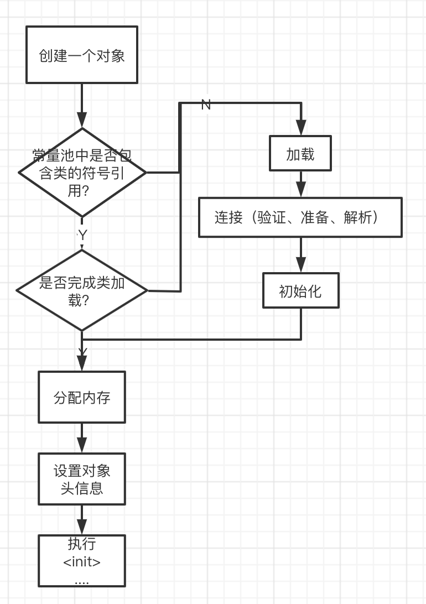
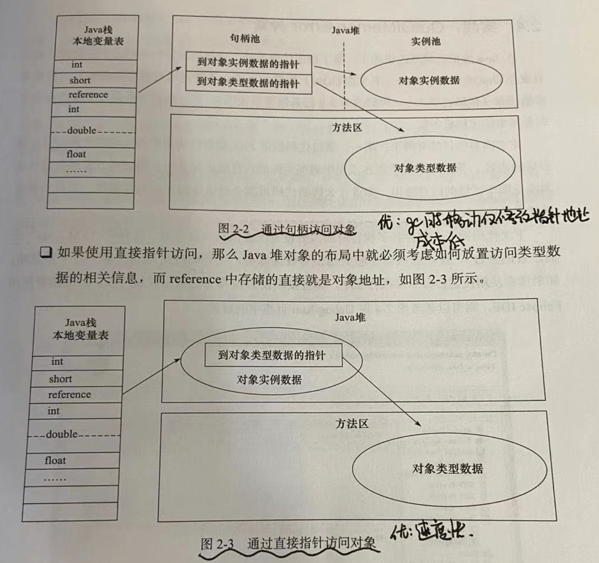

> 引言  
拜读了非常经典的《深入理解Java虚拟机》（并没有完全读透=。=），对整个jvm有了相对更深刻的理解，其中包括一些底层编译原理的知识，更是唤醒了大学时期的记忆。  
可惜那时上课光顾着和室友玩开心消消乐，只是应付了考试，并没有在脑中留下过多的印象~ 学习起来一向有点吊儿郎当的我，读此书的过程也是，战线拖了很长，导致每次读的知识都是碎片的，但即使如此，也能感受到作者从JVM的相关知识、细节结构、编译优化等分章明确，深入浅出，看的十分酥服~  
当然所有知识想要在脑中留下深刻印象，都离不开反复阅读、实战的过程。 趁我这个小脑仁还没有被别的东西覆盖前，进行整理总结，方便后面复习，吼吼😄

## Java前世今生
### jdk发展史
1991年4月，James领导的绿色计划（Green Project)开始启动，这边是Java语言的前身（Oak语言），1995年，Oak改名为Java，并发布了1.0版本。经历了30年的迭代，截止2021年已更新至JDK17，

各版本之间的差别可以参考以下文档：  
[维基百科](https://zh.wikipedia.org/wiki/Java%E7%89%88%E6%9C%AC%E6%AD%B7%E5%8F%B2)  
[JDK各个版本的区别](https://www.cnblogs.com/zhaozhitong/p/12253800.html)  
[oracle官网](https://docs.oracle.com/en/java/javase/17/docs/api/overview-summary.html)

### jvm发展史
书中常说的是基于Sun公司的HotSpot VM来说的，他是目前适用范围最广的JVM，除此之外，还有很多JVM，在不同的JVM上有不同的内存分配、gc策略、类加载机制等，这里不赘叙了，反正我也记不住。JVM是实现java支持跨平台、支持"一次编写、到处运行"的基础，他作为与『物理机』相对的概念，接受格式严谨的class文件（并不只是java可以转class,各种语言都行）并进行编译运行，保证了平台无关性。

## 自动内存管理机制
> 进入正题啦~ 本章也就是对应《深入理解Java虚拟机》中第二部分的总结，主要包含以下几点：
> - Java内存区域
> - 垃圾收集器与gc策略
> - JVM性能监控 & 故障处理工具

### Java内存区域
> 介绍JVM内存区域如何划分，以及各区域职责。

#### 方法区
- 是否线程共享：是
- 主要功能：存储已被jvm加载的`类信息`，`常量`，`静态变量`，`即时编译器编译后的代码`等
- 是否参与gc? 是（允许不回收方法区）
- 可能出现的异常？OutOfMemoryError

方法区有个别名叫'non-heap'，目的是与堆分开，这里存储的信息主要是一些元数据、静态变量等，比较像堆中的『永久代』数据（轻易不回收），在hotspot虚拟机中，将方法区的回收放置为永久代中，省去了单独编写gc的逻辑，但两者应该还是有区别的。

##### 运行时常量池
class文件中除了有类的`版本、字段、方法、接口等描述信息`，还有一项是`常量池`，用于存放`编译时`生成的`字面量 & 符号引用`，将在类加载后进入方法区的运行时常量。

运行时常量具备`动态性`，不一定只有编译期才会产生。
##### 静态变量
##### 类信息
##### 即时编译器编译后的代码

#### 堆
- 是否线程共享：是
- 主要功能：存储对象实例
- 是否参与gc? 是
- 可能出现的异常？OutOfMemoryError

所有对象实例&数组都要在堆上分配！

#### 虚拟机栈
- 是否线程共享：否
- 主要功能：存储`局部变量表`，`操作数栈`，`动态链接`，`方法出口`等
- 是否参与gc? 否(生命周期随线程消亡而亡)
- 可能出现的异常？OutOfMemoryError、StackOverFlow
- 服务对象：字节码（Java方法）

#### 程序计数器
- 是否线程共享：否
- 主要功能：当前线程所执行的字节码行为指示器
- 是否参与gc? 否(生命周期随线程消亡而亡)
- 可能出现的异常？无

#### 本地方法栈
- 是否线程共享：否
- 主要功能：存储`局部变量表`，`操作数栈`，`动态链接`，`方法出口`等
- 是否参与gc? 否(生命周期随线程消亡而亡)
- 可能出现的异常？OutOfMemoryError、StackOverFlow
- 服务对象：Native方法

### Java对象创建
> 介绍对象创建过程 & 内存布局
#### 对象创建过程

其中，分配内存有两种方式，主要取决于gc算法。
1. 内存连续，可使用『指针碰撞』方法

即，持有一个指针作为内存分界器，分配内存仅挪动指针

2. 内存不连续，可使用『空闲列表』方法

即，持有一个列表记录空闲内存块位置，分配内存后更新列表

⚠️ 内存分配需要考虑`并发情况`
- CAS（Compare and Swap)保证原子性
- TLAB（本地线程分配缓存）

#### 对象内存布局
在对象创建过程中，我们分配完内存后，需要设置对象头信息。那么一个对象在内存中的布局都包含哪些呢？

主要有这三个区域：`对象头(Header)`，`实例数据（Instance Data）`，`对齐填充(Padding)`

##### 对象头
由`自身运行时数据（Mark Word)`和`类型指针`组成
- Mark Word
    - 占用大小：32位JVM->32bit 64位JVM->64bit
    - 存储内容  

        | 存储内容        | 标志位   |  状态  |
        | --------   | -----  | ----  |
        | hashCode、分代年龄  | 01 |   未锁定  |
        | 指向锁记录指针       |   00 | 轻量级锁定 |
        | 指向重量级锁的指针   |   10 | 重量级锁定 | 
        | 空信息           |   11 |  gc标记  | 
        | 偏向线程ID，偏向时间戳  |    01  | 可偏向 | 
- 类型指针  
指向元数据的指针，通过此指针确定对象实例。

##### 实例数据
对象真正存储的有效信息

#### 对象访问的定位
我们知道，对象的类型数据，也就是对象头会被存在方法区，对象实例数据则在java堆的实例池中。若我们在虚拟机栈中，持有了一个对象的引用，如何定位对象？主要有两种方法：
1. 通过句柄访问对象（gc时移动成本低）
2. 直接指针访问对象（速度更快）

### gc & 内存分配
围绕经典gc灵魂三问展开
- 哪些对象需要gc?
- 什么时候gc?
- gc方式？

#### 哪些对象需要gc?
堆 & 方法区需要gc，其分配和回收都是动态的（运行时进行）。

那栈帧和程序计数器呢？ 他们是线程私有的，生命周期也是随着线程的生命周期走的，且在前期的类加载机制中，为栈帧分配多少内存，编译时期已确定，他的内存分配和回收都具备确定性。

> 对象的四种引用关系
- 强引用
    - 永远不会被gc
- 软引用
    - 有用但非必需对象，在内存oom前，将会被纳为回收对象，在下一次gc中若没有足够的空间，将会被gc
- 弱引用
    - 非必需对象，在gc时会被回收
- 虚引用
    - 无法通过虚引用获得对象实例，唯一目的是能在这个对象被gc时收到系统通知

> 如何判定对象已死？
- 引用计数算法
    - 给对象添加引用计数器，被引用+1，引用失效-1。
    - 无法处理互相引用的问题
- 可达性分析
    - 以可被称为"gc roots"的对象们作为起点，向下搜索引用链，若此对象不被任何一个gc root引用，则此对象不可用。
    - 可当gc roots的对象：
        - 虚拟机栈中（本地变量表）中引用的对象
        - 本地方法栈中引用的对象
        - 方法区中类`静态属性`引用的对象
        - 方法区中`常量`引用的对象
    
> finalize方法 —— 对象逃脱死亡命运的最后一招

⚠️ 当然，并不是建议通过此方法来绕过gc啦！！

首先， finalize只会被执行一次。在finalize方法中，若对象成功与活着的对象建立关联，则免除被gc的命运。

若对象被标记位不可达对象，会判断对象是否有finalize方法（若未重写或已经执行过，直接gc）  
否则，将对象放置在F-Queue队列中，gvm会低优先级的遍历此队列，执行finalize方法。

#### 什么时候gc?
- YGC的时机:(频繁)
    - edn空间不足
- FGC的时机：（不频繁,往往慢十倍以上）
    - old空间不足
    - perm空间不足
    - 显式调用System.gc()
    - YGC时的悲观策略

#### gc方式
- jvm分代

| 新生代 | | |老年代|永久代|
| ----- |-----|-----|-----|----|
|eden(8)|survivor(1)|survivor(1)|old|方法区

- 垃圾收集算法
    - 标记-清除算法 （缺点：效率、空间）
    - 复制算法 （空间换时间，适合新生代）
    - 标记-整理 (时间换空间，适合老年代)

- gc停顿  
所谓gc停顿是指，可达性分析时，对于gc root的遍历必须是停顿的，这样非常有损用户体验。jvm的解决方式是，通过`OopMap`数据结构来记录各个对象的引用关系，在gc时，可以通过此迅速遍历。当然，OopMap并不是把所有指令都实时记录下来，仅记录了处于`安全点/安全区域`的指令。
    - > 什么样的指令是安全点？  
    『是否具有让程序长时间执行的特征』  
    安全区域同理，在此代码片段中，引用关系不应改变
    - > 如何控制gc时所有类处于安全点？
    抢先示中断 or 主动式中断

#### 常用gc器
- Serial收集器
    - 元老收集器，使用单CPU进行gc，gc时需要暂停所有线程
- ParNew收集器
    - 多线程gc，gc时仍需要暂停所有线程，不可并发
- Parallel Scavenge收集器
    - 目标是提高吞吐量（运行用户代码时间/运行用户代码时间+gc时间），适合后台计算无过多交互任务，动态调整gc停顿时间。
- CMS收集器
    - 目标是最短回收停顿时长，gc过程分为四步骤
        - 初始标记（`暂停所有线程`，仅标记gc root关联对象）
        - 并发标记（`并发执行`，标记其他对象）
        - 重新标记（`暂停所有线程`，整体校验）
        - 并发清除（`并发执行`，执行清理，算法：标记-清除）
    - 优点：使gc过程部分并发！！
    - 缺点：无法处理浮动垃圾（标记、校验完，孩子又扔的）
- G1收集器
    - 多线程并行，部分工作可并发
    - 分代收集（代替单一清理策略）
    - 空间整合（类似标记-整理法，清除后会整理内存空间）
    - 可预测停顿时间

#### 对象分配策略
- jvm分代
    | 新生代 | | |老年代|永久代|
    | ----- |-----|-----|-----|----|
    |eden(8)|survivor(1)|survivor(1)|old|方法区

    - 新生对象优先进入伊甸园区
    - 大对象（长字符串/数组）直接进入老年区（空间分配担保）

- 对象年龄判断
    - 静态判断（Age计数器，经历一次gc+1，一般阈值为15）
    - 动态判断（survivor区年龄大于此区平均水平的可进入老年代）

- 空间分配担保
检查老年代最大连续空间是否大于历届晋升老年代的对象空间  
是，则认为有风险，需要进行一次Full GC
否，认为可以担保