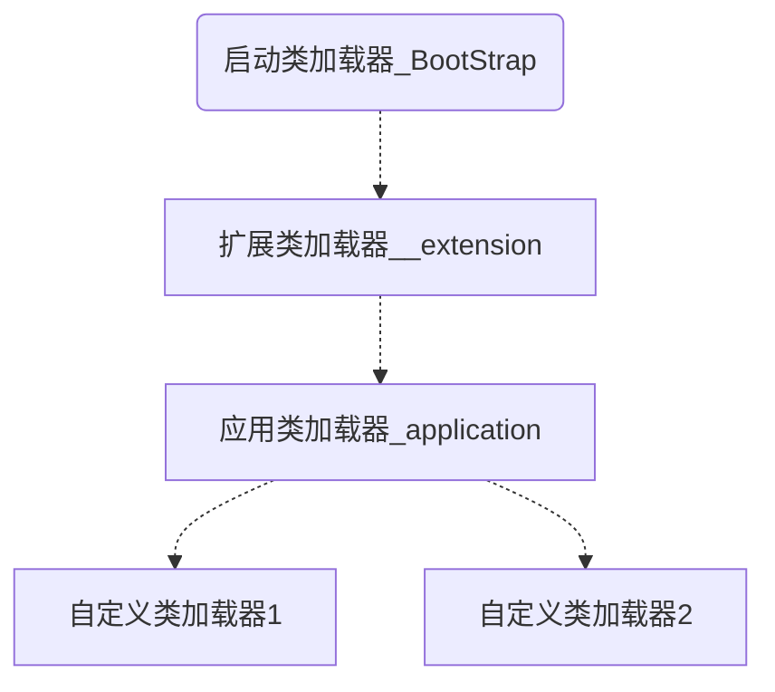

> Java的`可扩展性`就是得益于运行期动态加载和动态连接实现的

### 类的生命周期
类从加载到被卸载总共有7个阶段，分别是加载、链接（验证、准备、解析（时机不确定，可后置到初始化之后））、初始化、使用、卸载。


### 类加载时机
- 遇到`new`,`getstatic`,`putstatic`,`invokestatic` 字节指令码时，若未初始化，先初始化。
- 反射类时
- 初始化类时，若父类未初始化，先初始化父类
- 虚拟机启动时，先初始化主类（Android的主类是zygote?)

### 类加载过程
将介绍类加载的几个阶段的具体工作。
#### 加载
加载对象完成以下工作：
- 通过类的全限定名，定义类的二进制数据流
- 将字节流所代表的静态存储结构转化为方法区的运行时数据结构
- 在内存中生成代表类的Class对象，作为方法区中此类的访问入口

> 注意：数组的加载不走类加载的流程，是直接在虚拟机上完成的

#### 验证
> 主要目的：`自身保护`，确保class文件中的内容符合JVM要求。此阶段若校验失败会抛出异常`VertifyError`，它不是必须的。

具体来说就是：
- 文件格式验证：基于二进制字节流验证class文件格式，如魔数是否合规、版本号是否合规等。
- 元数据验证：基于方法区的存储结构验证，校验类是否有父类、是否可继承、是否需要实现接口/abstract方法，重载重写的方法是否有问题等等。
- 字节码校验：基于方法区验证，校验语义是否合法，如类型转化的有效性，int类型是否存成了long等等
- 符号引用验证：当解析时，会将符号引用转化为直接引用，此时会进行此校验。

#### 准备
> 主要目的：1. 为类分配内存（特指static变量） 2.设置类初始化阶段（static变量赋值）

通常情况下基本变量初始值为0，字段表中的`ConstantValue`会在准备阶段被赋值

#### 解析
> 特点：时机不定，可能在初始化之后面

> 主要目的：将常量池中的符号引用转化为直接饮用

什么是符号引用❓  
一组描述引用目标的符号，该目标不一定被加载到内存中区。

什么是直接引用❓  
一组描述引用目标的符号，该目标一定被加载到内存中区，通过直接引用可以找到具体的引用目标。

对一个符号引用解析成直接引用多次很常见，`invokedynamic`除外，动态加载类时会对第一次解析结果缓存。

解析动作主要针对<b>类/接口、字段、类方法、接口方法、方法类型、方法句柄、调用点</b>的符号引用进行

#### 初始化
> 主要目的：执行类构造器<clinit>() 方法

clinit如何生成❓  
它是由编译器自动收集类中所有的`类变量赋值动作` & `static{}块中的语句`

对static块中的变量只能赋值 不能引用， 如：
```java
static {
    i = 0; // ok
    System.out.println(i); // 编译失败，提示非法向前引用
}
```

- 父类方法会先执行<clinit> (JVM保证，无需显式调用)
- <clinit>对于一个类是非必须的
- 接口类中不会有static{}代码块
- 虚拟机会保证<clinit>在多线程环境中被正确加载


### 类加载器
java有三种类加载器  
- 根类加载器（bootstrap class loader）
    - 负责将`<JAVA_HOME>\lib`目录中的类库加载到JVM中
- 扩展类加载器(extension class loader)
    - 负责将`<JAVA_HOME>\lib\ext`目录中的类库加载到JVM中
- 应用类加载器(application class loader)
     - 负责将`用户类路径上`的类库加载到JVM中

关系如下图所示：


#### 双亲委派机制
> 好处：类加载器有优先级概念，保证基础类的稳定性。

```java
protected synchronized Class<?> loadClass(String name, boolean resolve) throws ClassNotFoundException {
    //1 首先检查类是否被加载
    Class c = findLoadedClass(name);
    if (c == null) {
        try {
            if (parent != null) {
             //2 没有则调用父类加载器的loadClass()方法；
                c = parent.loadClass(name, false);
            } else {
            //3 若父类加载器为空，则默认使用启动类加载器作为父加载器；
                c = findBootstrapClass0(name);
            }
        } catch (ClassNotFoundException e) {
           //4 若父类加载失败，抛出ClassNotFoundException
        }
        if (c == null) {
            //5 再调用自己的findClass() 方法。
            c = findClass(name);
        }
    }
    if (resolve) {
        resolveClass(c);
    }
    return c;
}
```

在插件化或者热修复的场景中，我们可以通过自定义类加载器或hook类加载器中参数，以达到破坏双亲委托流程的目的。
